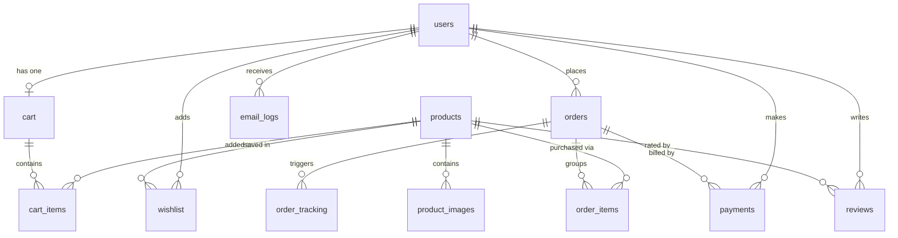

# MyShopee - Neon PostgreSQL Schema Reference

This document describes the structure, data fields, constraints, and relationships for MyShopee's database.

---

## 🗺️ Entity Relationship Diagram

---

## 🗄️ Tables Reference

### 1. `users`
Tracks user credentials and sync status with Firebase Authentication.
* **Primary Key**: `id` (SERIAL)
* **Constraints**: `firebase_uid` (UNIQUE), `email` (UNIQUE)

| Column Name | Data Type | Constraints | Description |
| :--- | :--- | :--- | :--- |
| `id` | SERIAL | PRIMARY KEY | Unique auto-increment identifier |
| `firebase_uid` | VARCHAR(128) | UNIQUE, NOT NULL | Firebase Authentication User UID |
| `name` | VARCHAR(255) | NOT NULL | User's display name |
| `email` | VARCHAR(255) | UNIQUE, NOT NULL | User's email |
| `role` | VARCHAR(50) | DEFAULT 'customer' | Role: 'customer' or 'admin' |
| `created_at` | TIMESTAMP | DEFAULT CURRENT_TIMESTAMP | Date and time profile registered |

---

### 2. `products`
Lists all store products imported from DummyJSON or added manually by admin.
* **Primary Key**: `id` (SERIAL)

| Column Name | Data Type | Constraints | Description |
| :--- | :--- | :--- | :--- |
| `id` | SERIAL | PRIMARY KEY | Unique auto-increment identifier |
| `title` | VARCHAR(255) | NOT NULL | Product title |
| `description` | TEXT | | Detailed product description |
| `category` | VARCHAR(100) | | Product category class |
| `brand` | VARCHAR(100) | | Product brand brand |
| `price` | DECIMAL(10,2) | NOT NULL | Price in dollars |
| `discount` | DECIMAL(5,2) | DEFAULT 0.00 | Discount percentage (0-99%) |
| `rating` | DECIMAL(3,2) | DEFAULT 0.00 | Aggregated average rating (1-5) |
| `stock` | INTEGER | DEFAULT 0 | Inventory units available |
| `created_at` | TIMESTAMP | DEFAULT CURRENT_TIMESTAMP | Date product added |

---

### 3. `product_images`
Product media assets gallery URLs. Images are stored on Cloudinary.
* **Primary Key**: `id` (SERIAL)
* **Foreign Key**: `product_id` references `products(id)` ON DELETE CASCADE

| Column Name | Data Type | Constraints | Description |
| :--- | :--- | :--- | :--- |
| `id` | SERIAL | PRIMARY KEY | Unique auto-increment identifier |
| `product_id` | INTEGER | REFERENCES products | Associated product identifier |
| `image_url` | TEXT | NOT NULL | Cloudinary secure URL path |
| `public_id` | VARCHAR(255) | NOT NULL | Cloudinary file identifier (for delete actions) |

---

### 4. `cart`
Shopping cart instance owned by a customer.
* **Primary Key**: `id` (SERIAL)
* **Foreign Key**: `user_id` references `users(id)` ON DELETE CASCADE (UNIQUE)

| Column Name | Data Type | Constraints | Description |
| :--- | :--- | :--- | :--- |
| `id` | SERIAL | PRIMARY KEY | Unique auto-increment identifier |
| `user_id` | INTEGER | REFERENCES users, UNIQUE | Owner's identifier |

---

### 5. `cart_items`
Lists products added to a cart.
* **Primary Key**: `id` (SERIAL)
* **Foreign Key**: `cart_id` references `cart(id)` ON DELETE CASCADE
* **Foreign Key**: `product_id` references `products(id)` ON DELETE CASCADE
* **Constraints**: UNIQUE (`cart_id`, `product_id`)

| Column Name | Data Type | Constraints | Description |
| :--- | :--- | :--- | :--- |
| `id` | SERIAL | PRIMARY KEY | Unique auto-increment identifier |
| `cart_id` | INTEGER | REFERENCES cart | Parent cart identifier |
| `product_id` | INTEGER | REFERENCES products | Added product identifier |
| `quantity` | INTEGER | DEFAULT 1, CHECK > 0 | Amount to purchase |

---

### 6. `wishlist`
Product wishlist list for users.
* **Primary Key**: `id` (SERIAL)
* **Foreign Key**: `user_id` references `users(id)` ON DELETE CASCADE
* **Foreign Key**: `product_id` references `products(id)` ON DELETE CASCADE
* **Constraints**: UNIQUE (`user_id`, `product_id`)

| Column Name | Data Type | Constraints | Description |
| :--- | :--- | :--- | :--- |
| `id` | SERIAL | PRIMARY KEY | Unique auto-increment identifier |
| `user_id` | INTEGER | REFERENCES users | Owner's identifier |
| `product_id` | INTEGER | REFERENCES products | Saved product identifier |

---

### 7. `orders`
Purchased items receipts.
* **Primary Key**: `id` (SERIAL)
* **Foreign Key**: `user_id` references `users(id)` ON DELETE SET NULL

| Column Name | Data Type | Constraints | Description |
| :--- | :--- | :--- | :--- |
| `id` | SERIAL | PRIMARY KEY | Unique auto-increment identifier |
| `user_id` | INTEGER | REFERENCES users | Buyer's identifier |
| `total_amount` | DECIMAL(10,2) | NOT NULL | Order total cost (subtotal - discounts + tax) |
| `payment_status` | VARCHAR(50) | DEFAULT 'pending' | 'pending', 'paid', 'failed' |
| `order_status` | VARCHAR(50) | DEFAULT 'Placed' | 'Placed', 'Confirmed', 'Packed', 'Shipped', 'Out For Delivery', 'Delivered' |
| `created_at` | TIMESTAMP | DEFAULT CURRENT_TIMESTAMP | Creation timestamp |

---

### 8. `order_items`
Lists individual items within an order.
* **Primary Key**: `id` (SERIAL)
* **Foreign Key**: `order_id` references `orders(id)` ON DELETE CASCADE
* **Foreign Key**: `product_id` references `products(id)` ON DELETE SET NULL

| Column Name | Data Type | Constraints | Description |
| :--- | :--- | :--- | :--- |
| `id` | SERIAL | PRIMARY KEY | Unique auto-increment identifier |
| `order_id` | INTEGER | REFERENCES orders | Associated order ID |
| `product_id` | INTEGER | REFERENCES products | Associated product ID |
| `quantity` | INTEGER | NOT NULL | Quantity bought |
| `price` | DECIMAL(10,2) | NOT NULL | Price at purchase timestamp |

---

### 9. `payments`
Transactions details received from Stripe Webhooks.
* **Primary Key**: `id` (SERIAL)
* **Foreign Key**: `user_id` references `users(id)` ON DELETE SET NULL
* **Foreign Key**: `order_id` references `orders(id)` ON DELETE SET NULL

| Column Name | Data Type | Constraints | Description |
| :--- | :--- | :--- | :--- |
| `id` | SERIAL | PRIMARY KEY | Unique auto-increment identifier |
| `user_id` | INTEGER | REFERENCES users | Buyer identifier |
| `order_id` | INTEGER | REFERENCES orders | Billed order ID |
| `stripe_session_id` | VARCHAR(255) | | Stripe checkout session ID |
| `stripe_payment_intent_id` | VARCHAR(255) | | Stripe payment intent code |
| `amount` | DECIMAL(10,2) | NOT NULL | Amount paid |
| `currency` | VARCHAR(10) | DEFAULT 'usd' | Transaction currency |
| `status` | VARCHAR(50) | NOT NULL | Payment status (e.g. 'succeeded') |
| `created_at` | TIMESTAMP | DEFAULT CURRENT_TIMESTAMP | Verification date |

---

### 10. `order_tracking`
History logs of delivery status changes. Used to render customer tracking dashboards.
* **Primary Key**: `id` (SERIAL)
* **Foreign Key**: `order_id` references `orders(id)` ON DELETE CASCADE

| Column Name | Data Type | Constraints | Description |
| :--- | :--- | :--- | :--- |
| `id` | SERIAL | PRIMARY KEY | Unique auto-increment identifier |
| `order_id` | INTEGER | REFERENCES orders | Associated order ID |
| `status` | VARCHAR(50) | NOT NULL | Status code ('Placed', 'Shipped', etc.) |
| `message` | TEXT | | Descriptive detail log |
| `created_at` | TIMESTAMP | DEFAULT CURRENT_TIMESTAMP | Change timestamp |

---

### 11. `reviews`
Ratings left by customers for purchased items.
* **Primary Key**: `id` (SERIAL)
* **Foreign Key**: `product_id` references `products(id)` ON DELETE CASCADE
* **Foreign Key**: `user_id` references `users(id)` ON DELETE CASCADE
* **Constraints**: UNIQUE (`product_id`, `user_id`), Check (`rating` between 1 and 5)

| Column Name | Data Type | Constraints | Description |
| :--- | :--- | :--- | :--- |
| `id` | SERIAL | PRIMARY KEY | Unique auto-increment identifier |
| `product_id` | INTEGER | REFERENCES products | Rated product ID |
| `user_id` | INTEGER | REFERENCES users | Writing user ID |
| `rating` | INTEGER | CHECK (1-5), NOT NULL | Customer rating score |
| `comment` | TEXT | | Review comment text |
| `created_at` | TIMESTAMP | DEFAULT CURRENT_TIMESTAMP | Review submission timestamp |

---

### 12. `email_logs`
Logs of transactional notification emails sent through Brevo.
* **Primary Key**: `id` (SERIAL)
* **Foreign Key**: `user_id` references `users(id)` ON DELETE CASCADE

| Column Name | Data Type | Constraints | Description |
| :--- | :--- | :--- | :--- |
| `id` | SERIAL | PRIMARY KEY | Unique auto-increment identifier |
| `user_id` | INTEGER | REFERENCES users | Recipient identifier |
| `email_type` | VARCHAR(100) | NOT NULL | Email template code ('welcome', 'shipping', etc.) |
| `status` | VARCHAR(50) | NOT NULL | Deliver status ('sent' or 'failed') |
| `sent_at` | TIMESTAMP | DEFAULT CURRENT_TIMESTAMP | Delivery timestamp |
